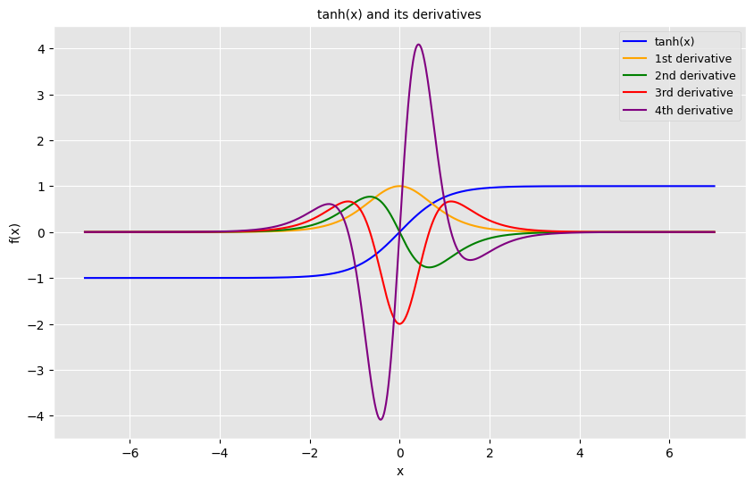

# ArrayX

**For lightning fast array operations with native autograd support**

---

Neural networks are fascinating - with just a few lines of code, you can build models that recognize handwritten digits, classify audio, interpret text, and much more!

At the heart of these models lies **automatic differentiation**; a powerful technique that allows you to compute gradients efficiently. By calculating partial derivatives of functions with respect to parameters, we can understand how each parameter influences the outcome and optimize it accordingly using methods like gradient descent.

Inspired by this, I explored the underlying principles of autograd systems and built this lightweight yet functional automatic differentiation engine. It supports **higher-order gradients**, enabling you to compute derivatives of derivatives seamlessly.

---

## Example usage

**Here is a simple example of differentiation 🤓**
```python
>>> import arrx as rx
>>> from arrx.autometa import grad
>>> x = rx.array(5.0)
>>> f = lambda x: x ** 3
>>> dx = grad(f)
>>> print('dx:', dx(x))
dx: 75.0
```
**Now let's plot the higher order derivatives of a beautiful function**

```python
>>> import arrx as rx 
>>> from arrx.autometa import grad     # Only tool you'll be needed to calculate precise gradients
>>> import numpy as np
>>> import matplotlib.pyplot as plt
>>> x = np.linspace(-7, 7, 700)
>>> f = lambda x: rx.tanh(x)     # Just define a function
>>> plt.plot(
...     x, f(x).numpy(),                         # f(x),
...     x, grad(f)(x).numpy(),                   # dx
...     x, grad(grad(f))(x).numpy(),             # d2x
...     x, grad(grad(grad(f)))(x).numpy(),       # d3x
...     x, grad(grad(grad(grad(f))))(x).numpy()) # d4x
>>> plt.show()
```

